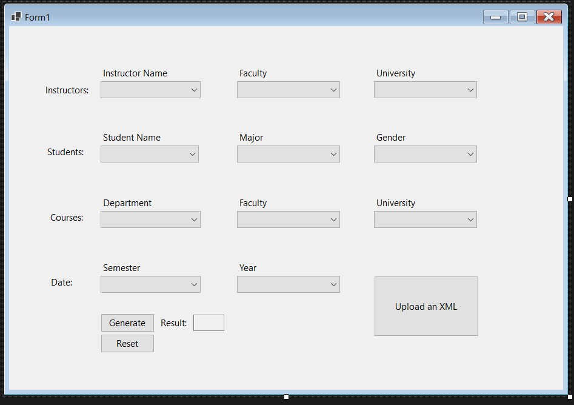
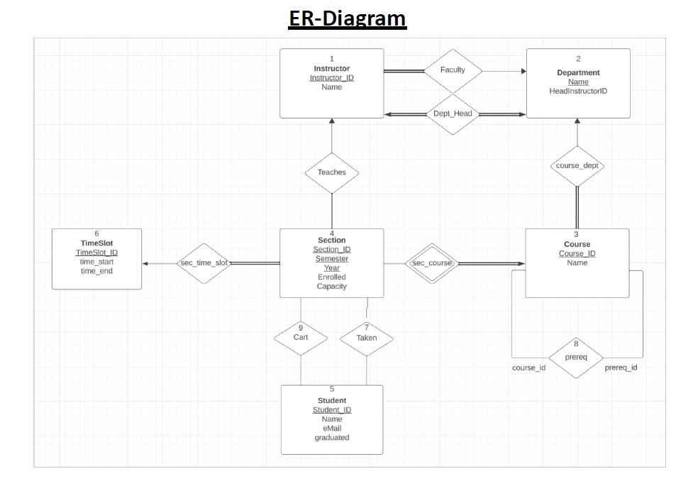

# 📄 XML Upload Web App

## Overview
A sleek, lightweight web application built in Visual Studio using C# that lets users upload and process XML files through a simple form interface. Ideal for fast data ingestion and easy backend parsing.

---

## 🔧 Features

-  Upload `.xml` files via a user-friendly web form  
-  Server-side validation using C#  
-  Easy to extend with database or API integration  
-  Clean and minimal UI for intuitive use

---

## 📐 Entity-Relationship Diagram

---

## 🚀 Getting Started

1. **Open in Visual Studio**  
   Clone or download the project and open the `.sln` file.

2. **Run the App**  
   Press `Ctrl + F5` or use the green play button to launch the web app locally.

3. **Use the Upload Form**  
   Navigate to the form in your browser and test by uploading a valid XML file.

---

## 🧠 Tech Stack

- ASP.NET Web Forms (C#)
- Visual Studio 2022+

---

